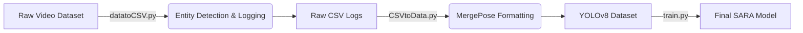

# MergePose: Automated Dataset Generation for Equestrian Form Analysis


**Official implementation of the MergePose data pipeline.**

This repository contains the dataset generation and training logic for **SARA (Smart Assistant for Riding Analysis)**. It features a streamlined pipeline to ingest raw equestrian footage, extract distinct horse and rider pose metrics, and fuse them into a unified YOLO-formatted dataset for fine-tuning.

🔗 **Project Website / Main Repo:** [SARA-AI](https://github.com/HashemW/SARA)

---

## 👥 Authors

**[Your Name]**, **[Advisor Name]**
*Submitted to the International Conference on Pattern Recognition (ICPR), 2026.*

---

## 🏗️ Pipeline Architecture

The pipeline follows a modular "extraction-fusion-training" workflow designed to handle large-scale video datasets (50GB+).



---

## 🚀 Installation

```bash
git clone [https://github.com/HashemW/MergePose.git](https://github.com/HashemW/MergePose.git)
cd MergePose
pip install ultralytics pandas opencv-python numpy

```

---

## 🛠️ Usage

The pipeline is designed to be executed sequentially to process raw video into a trainable model.

### 1. Data Preparation

Place your raw video files in a dedicated `dataset/` directory.
*(Note: The original 50GB dataset is not included in this repository due to size constraints. See `VideoSources.txt` for source attribution.)*

### 2. Pose Extraction (Data Generation)

Run the extraction script to detect Horse + Rider entities and log their coordinates to CSV.

```bash
python DataGenerationScripts/datatoCSV.py

```

### 3. Format Conversion

Fuse the raw CSV logs into a standardized YOLOv8 training structure (images + labels).

```bash
python DataGenerationScripts/CSVtoData.py

```

### 4. Model Training

Fine-tune the YOLO model on the generated dataset.

```bash
python train.py --epochs 100

```

---

## 📂 Repository Structure

```text
MergePose/
├── DataGenerationScripts/
│   ├── datatoCSV.py       # Entity detection & raw coordinate logging
│   └── CSVtoData.py       # Conversion logic for YOLO formatting
├── train.py               # Training entry point for the final model
├── VideoSources.txt       # Attribution for public domain footage used
└── README.md              # Documentation

```

---

## ⚠️ Note on Weights & Data

The pre-trained weights (`best.pt`) and the full proprietary dataset are withheld to protect intellectual property and commercial viability. This repository provides the complete scaffolding to reproduce the data generation process and train your own models using the **MergePose** methodology.

Since you are submitting to ICPR 2026, make sure to replace **[Your Name]** and **[Advisor Name]** with the actual names used in the paper submission. This makes the repo look "official" immediately.

```
